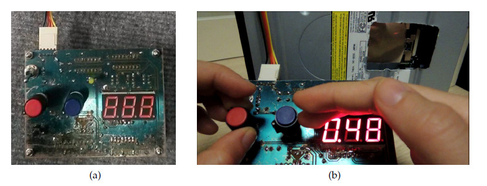
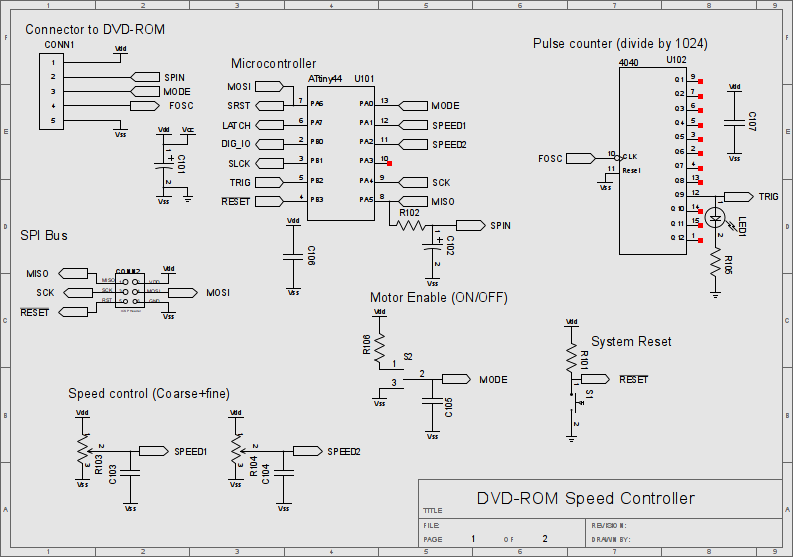
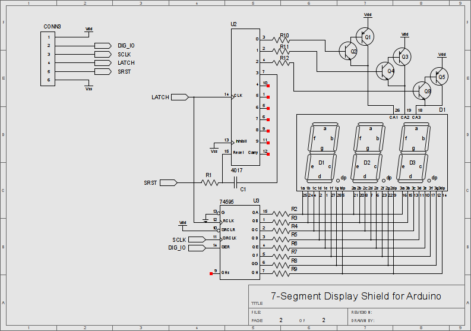
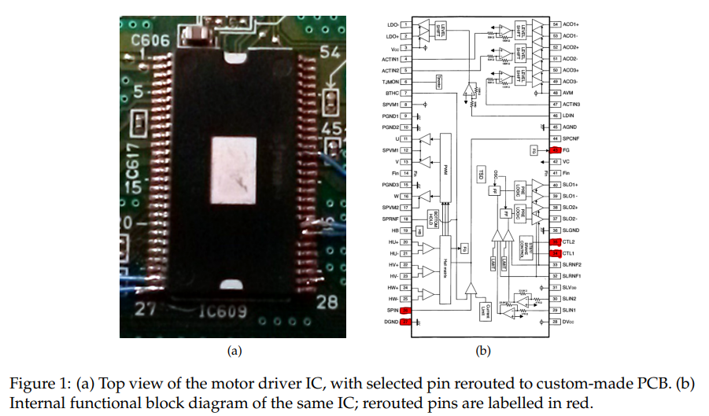
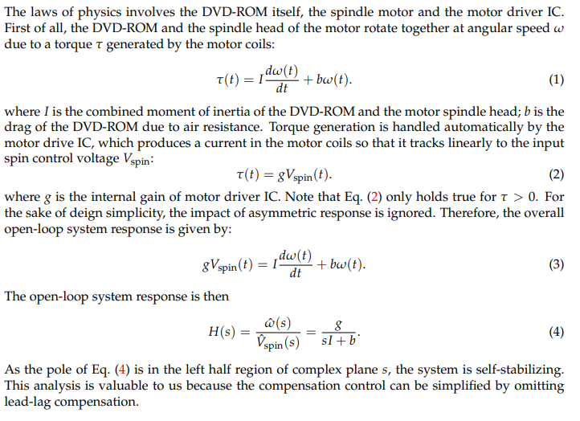
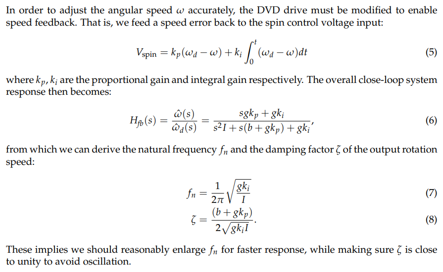
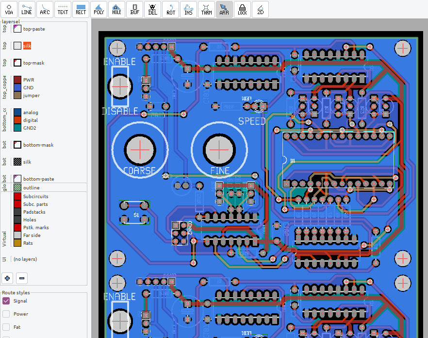
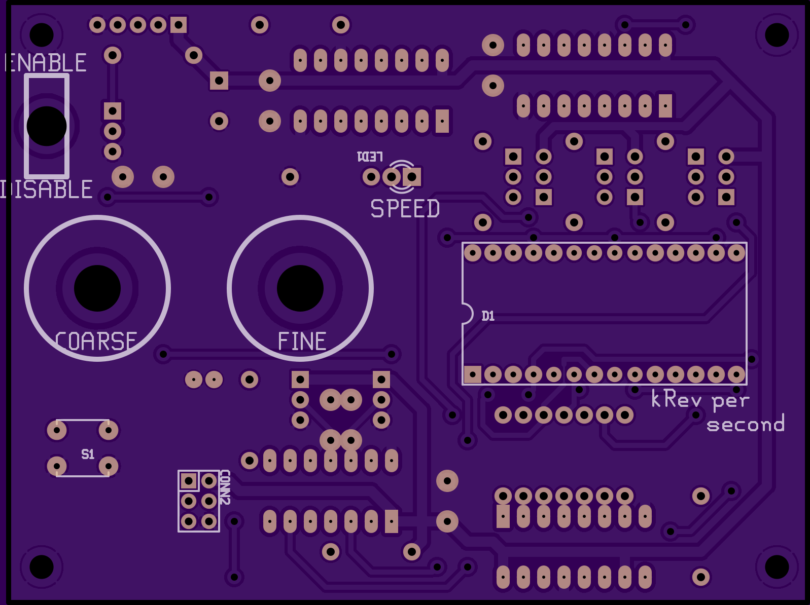
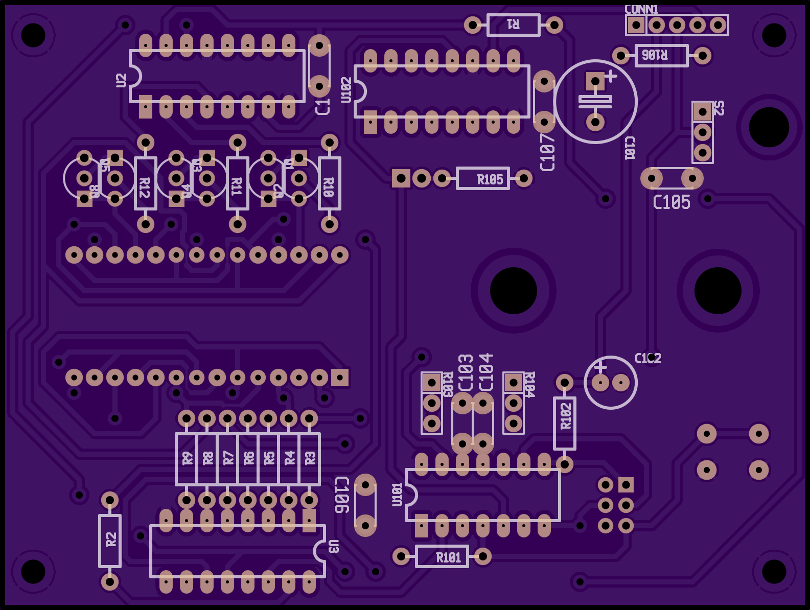

# Spinning flow-cell controller with conventional DVD/BD drives

The custom PID controller board to maintain the rotation speed of the DVD/BD
drive at a user-provided RPM value.

Note: This project is inspired by the blog post
http://akashkumar4u.blogspot.hk/2013/05/cddvd-motor-driver-hack-to-run-its-own.html

Technical specifications:

* Input power: 5VDC, 200mA;

* Output: torque control signal for the DVD spindle motor driver IC, [Rohm BD7998EFS](datasheet/bd7956fs.djvu).

* RPM speed sensing: rotary encoder pulse signal, converted from the built-in hall sensor of the DVD drive.

* Display: kilo-RPM value on the 7-segment LED numerical display;

* MCU Programming interface: SPI bus to program the ATTiny MCU.

* Set point control: Manual adjustment knobs; one for coarse adjustment (+/- 1
  kilo-RPM); one for fine adjustment (+/- 50 RPM).

## Why I made my own board

The board is part of the rotational digital histology imaging system: to study how one can rapidly image a custom Petri dish with adherent mammalian cells. The disk/dish is scanned with a one-dimensional image sensor (at 100 MHz line rate) following a outward spiral trajectory, so it is absolutely necessary to control the RPM precisely for image registration.

Reference: Anson H. L. Tang, P. Yeung, Godfrey C. F. Chan, Barbara P. Chan, Kenneth K. Y. Wong, and Kevin K. Tsia, “Time-stretch microscopy on a DVD for high-throughput imaging cell-based assay,” Biomed. Opt. Express 8, 640–652 (2017). https://doi.org/10.1364/BOE.8.000640

The schematic is eventually re-designed to synchronize the RPM with the x-axis linear stage.

## Preview

## Schematics

## Design intent

The overarching goal, at the time, was to justify the investment of custom control circuit in an optics research lab. With minimal budget, I wish to prove that:

* it is intuitive enough to reverse-engineer a conventional DVD drive for manual RPM control;

* advanced control logic, e.g. lead-lag compensation, can be programmed with MCUs; no hardwired analog OpAmp circuit required.

* the RPM control board and the DVD drive can be quickly integrated into the high-speed microscopy system (at 100 image line scan rate) without impacting research timeline.

... so I can justify more inventment on a professionally made driver board for the research, like what (Ultima Genomics did with their spinning flowcells)[]https://www.biorxiv.org/content/10.1101/2022.05.29.493900v1.full].

**Understanding the DVD motor spindle driver IC** The DVD drive is dissembled to
inspect spindle motor driver IC (Fig. 1a) on the control board. The
corresponding datasheet is sought from the Internet to locate the essential pin
to interface with the motor control functions (Fig. 1b). Specifically, pin 35,34
toggles between spindle motor enable and DVD tray enable; pin 26 controls the
spindle motor torque; pin 43 relays the speed information back to the
microcontroller (Fig. 1). 

**Developing the feedback control theory**

## PCB routing

The board was designed at the time when solder paste and cheap PCB fabhouse were cost prohibitive. We developed the photo-resist mask, and etch the PCB in house.
Through hole component were the only options. To create throughhole vias, a solid core copper at 22 AWG were inserted and buried with solder.

If I were to route the PCB again, I would have used SMT components to shrink the board down.

## Literatures

* DVD motor driver hack to run its own 3 phase BLDC motor. http://akashkumar4u.blogspot.hk/2013/05/cddvd-motor-driver-hack-to-run-its-own.html